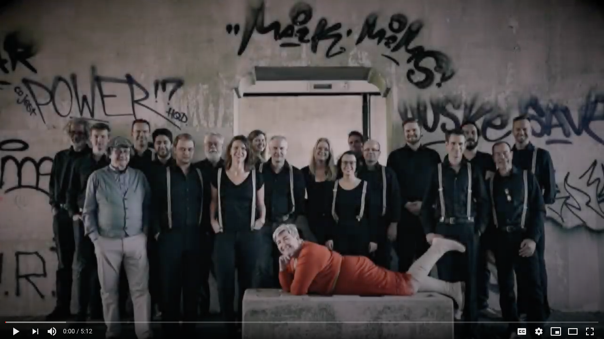

What do 23 bigband musicians do while in quarantine? Of cource they will try to make music. Enjoy a recording 
from a virtual bigband: completely recorded from the safety of our homes.

## The setup

During the lock down rehearsals with the Pete's corner bigband were not possible. We decided to do some home-recording 
instead. A click/backing track with chord changes of *All of me* was used so everyone could record his own part: the 
result was mixed and spiced up with some video. 

The video was done with iMovie. All audio mixing with Logic Pro.

## The result

You can see the result here:

If you want to play a solo yourself: that's fine [here](https://www.dropbox.com/s/0uw2xw0wy4ms3sp/all%20of%20me%20without%20solo.mp3?dl=0) you will find a versions without the solo's.

Drop me a DM on [twitter](https://twitter.com/acidjunk) if you want me to publish you version here!
