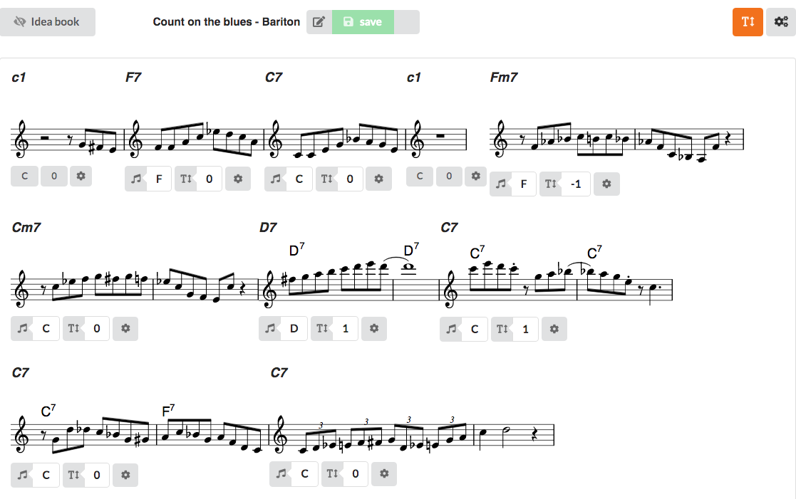
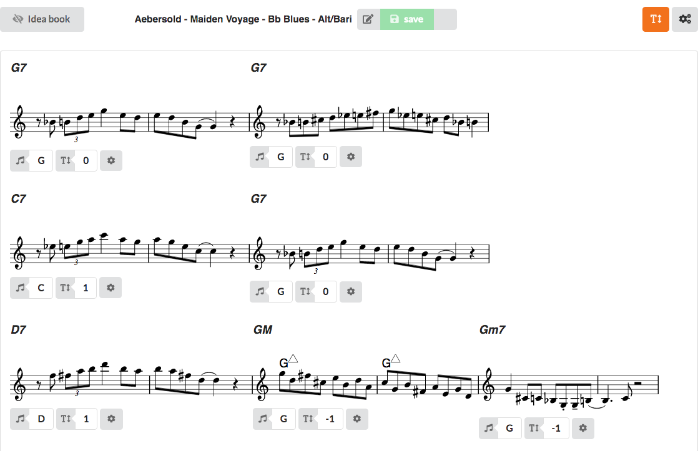

iMprovising over a blues is also a good way to practice scales and before you think this will be all over 
blues scales: it isn't. In this blog post I will show you how you can easily solo for 4 -5 choruses over 
a major blues whilst still keeping it interesting for the audience.

## iMprovising over major blues

As this is only a blog post it will be short. When the lessons module is ready there will be a lesson about 
the apporach and it will have move info about the how and why of the chorus buidlign blocks.

<Scale></Scale>

### The exercise

I want to share 2 exercises. The first one uses verticals in the first chorus and mixolydian scales in the second 
chorus. The second one shows how to play 5 choruses over Aebersold.

### Exercise 1: Count on the Blues

Based on the chords from Count on the Blues, for Alto / Bariton sax:

[View](https://www.improviser.education/exercise/d21ebeac-299f-4dfc-85ec-752783778eca) exercise on improviser.education

### Exercise 2: Bb Blues (5 choruses)

A study on a Aebersold number for alto/bari sax. You can use the Aebersold backing track from Vol 54, Track 03

[View](https://www.improviser.education/exercise/71e33ce7-2574-4505-8c05-84ae6fbed429) exercise on improviser.education
