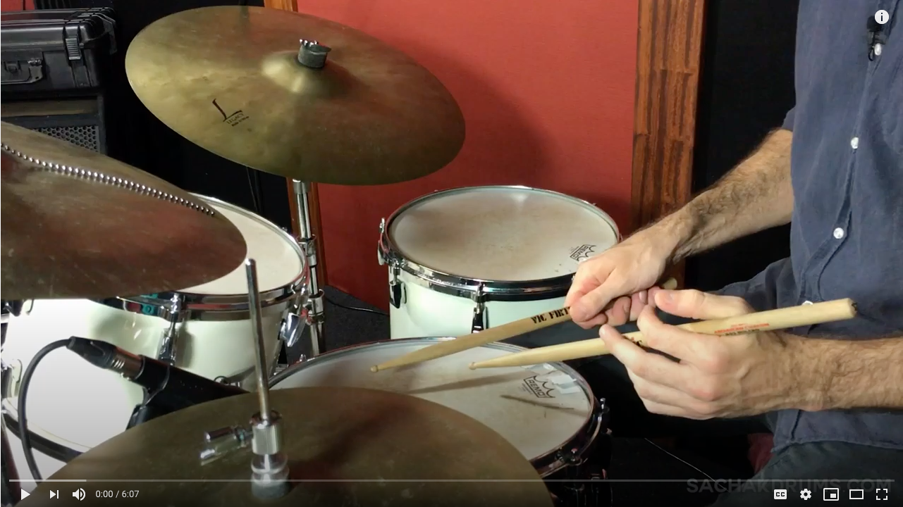
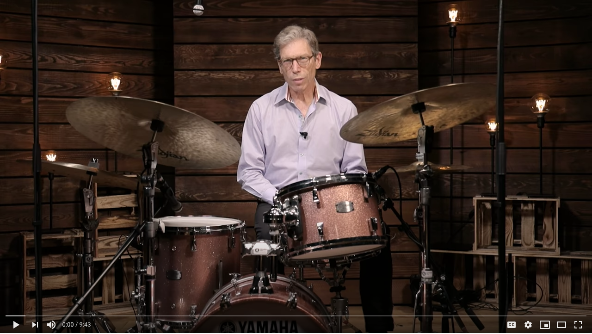
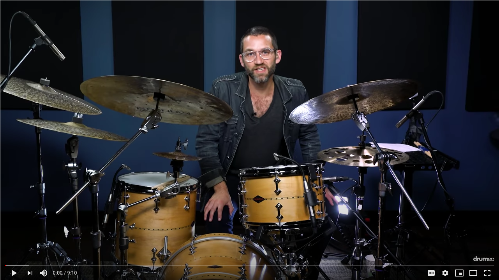

Always wondered how to play a nice swinging jazzy drum track? Here are some youtube lessons to quickly get you up to speed 
with it.

## Basic rhythm (beginner)

The basic Ride and hihat swing pattern used in a jazz:

## Soloing

Some practical tips when soling over jazz.

## 5 Iconic Jazz Drum Licks

If you want more, this is for the more advanced players. 5 Epic Drum patterns you can use to spice it all up.

